# DevSecOps Project

In this repository, I'm showcasing my hands-on experience with various DevSecOps tools including:

- Docker
- Kubernetes
- AWS
- SonarQube
- Trivy
- Jenkins
- Grafana
- Prometheus
- Argo CD

The main mission of the project is to deploy a Netflix app using CI/CD technologies to automatically integrate and deliver the app to AWS.

### Disclaimer

All of these are CloudChamp's infrastructure and steps, which I learned from here:

[Source Video & Knowledge](https://youtu.be/g8X5AoqCJHc?si=tUW8rN_HwOQL6Dg6)

## Brief Steps Overview

1. **AWS Setup**: Configure your AWS environment, setting up necessary services like EC2, EKS, and IAM roles for permissions. The image below is the summary of services I used in this project.

   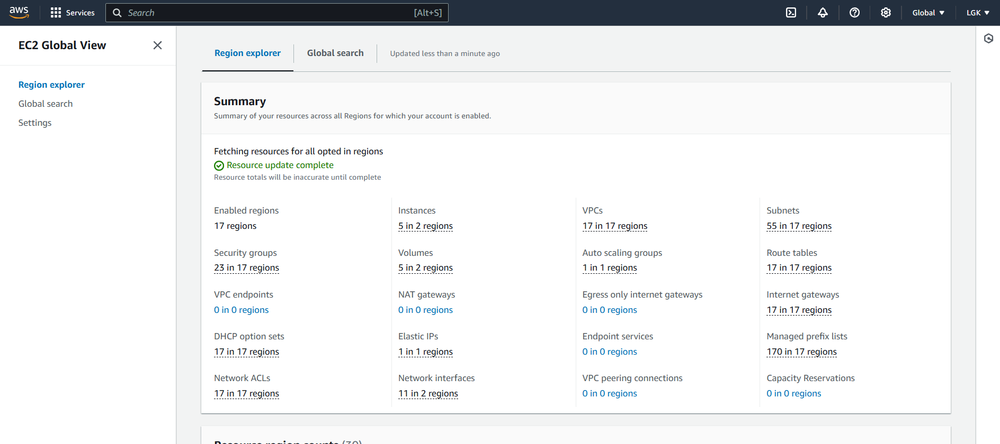

2. **Docker and Kubernetes**: Using Docker images, pushing them to Docker Hub using Jenkins to automate image creation. Creating EKS (Elastic Kubernetes Service) to orchestrate the containers, which pulls the image from the CloudChamp repository (you could pull the Docker image from your repo too).

   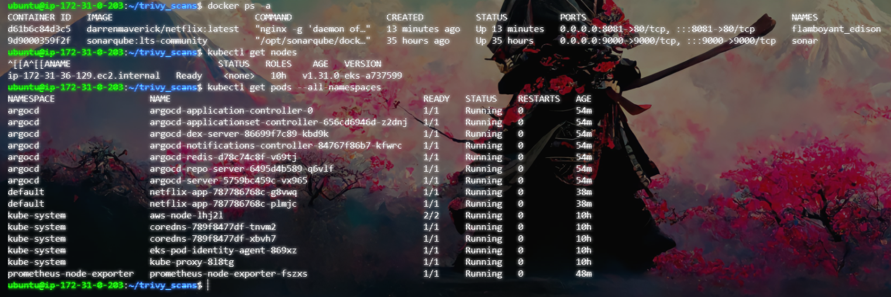

3. **Code Quality with SonarQube**: Integrate SonarQube for static analysis to check code quality and security vulnerabilities.

   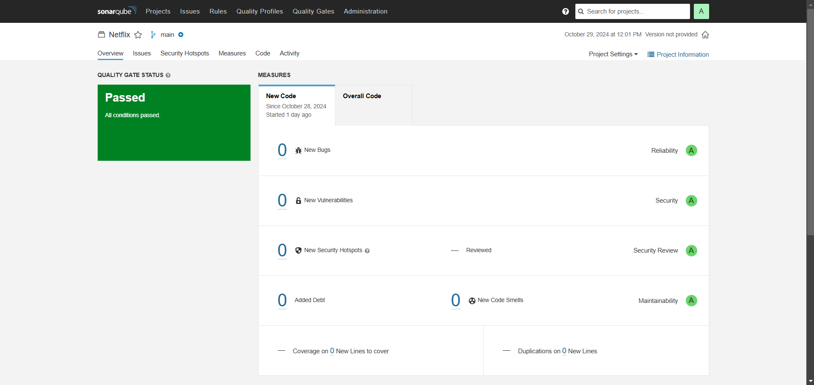
   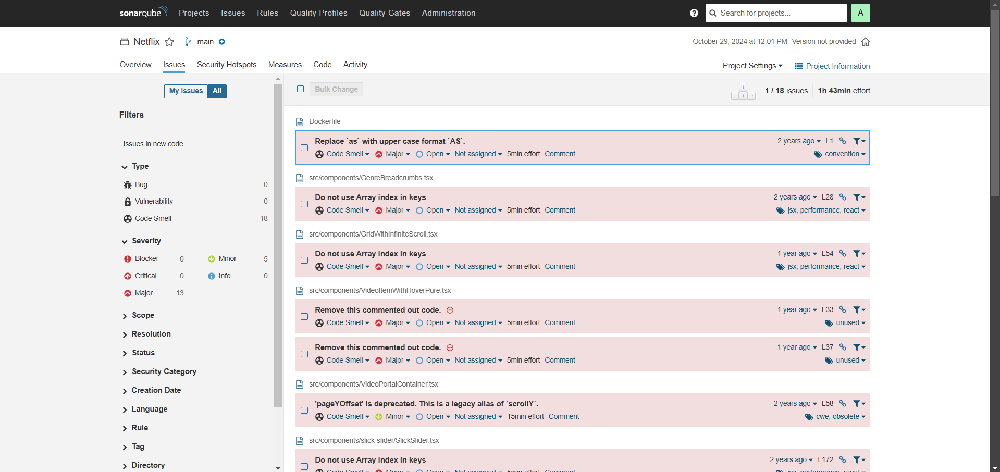

4. **Security Scanning with Trivy**: Use Trivy to scan Docker images for vulnerabilities, ensuring a secure deployment process.

   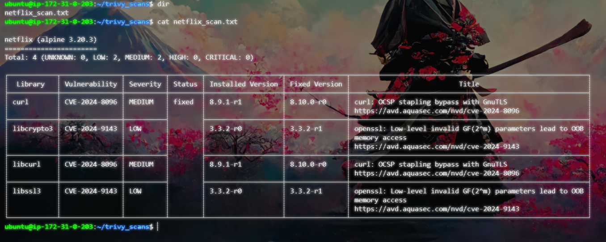

5. **Continuous Integration with Jenkins**: Set up Jenkins to automate the build and testing processes, creating pipelines for deployment.

   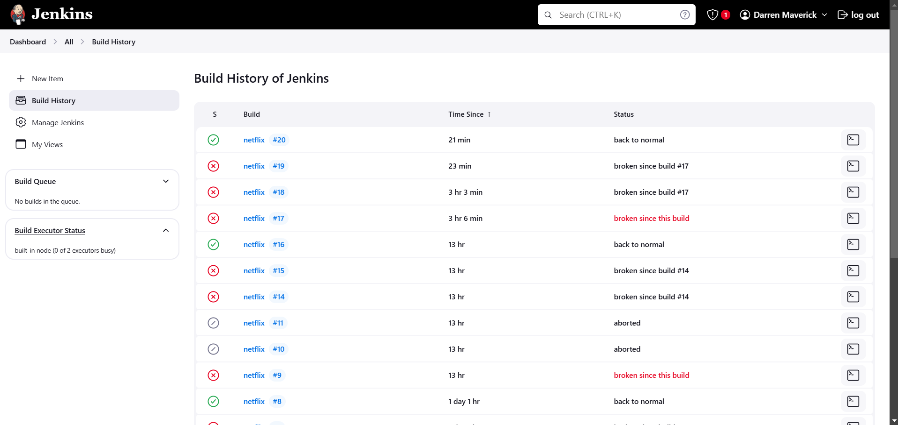
   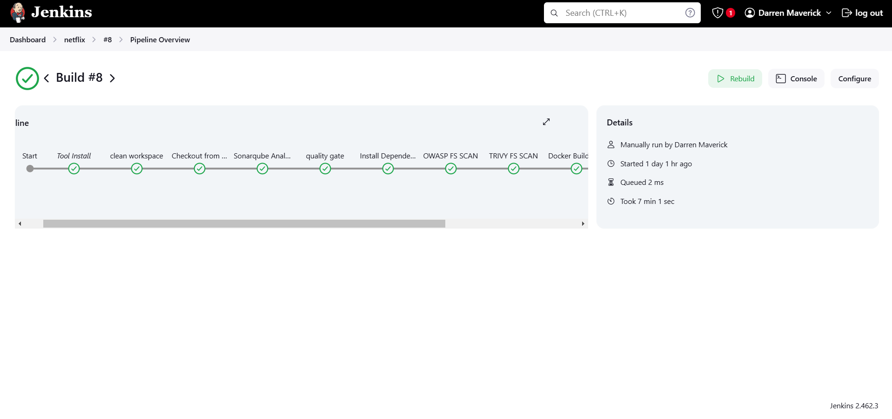

6. **Monitoring with Grafana and Prometheus**: Implement Grafana and Prometheus to monitor application performance and infrastructure metrics.

   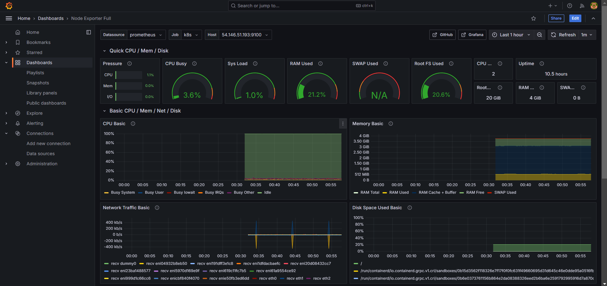
   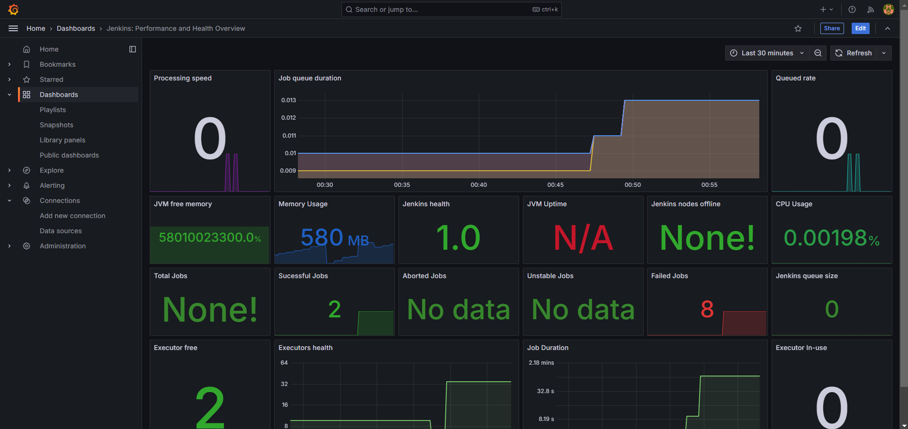
   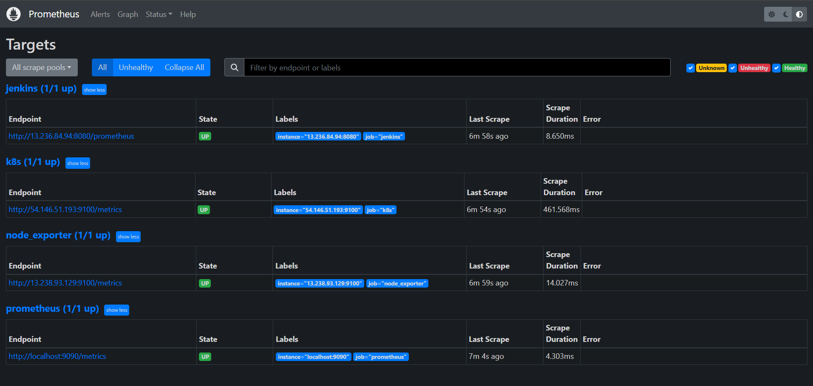
   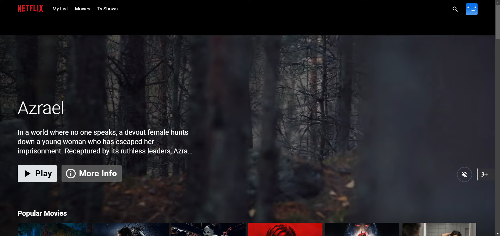

7. **Continuous Delivery with Argo CD**: Use Argo CD for GitOps deployment management, ensuring deployments stay in sync with the code repository.

   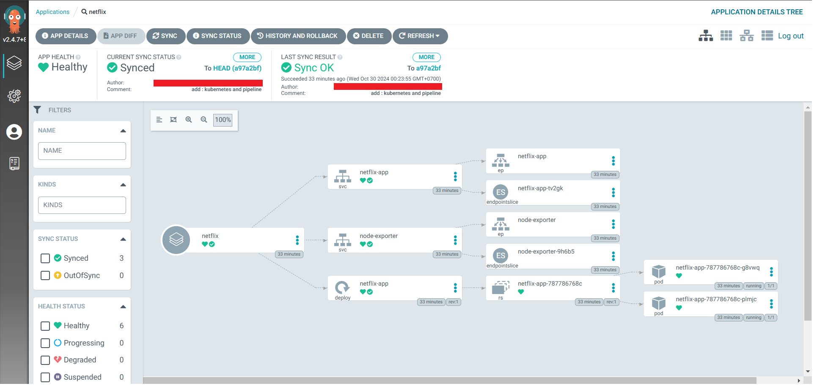

## Conclusion

By following these steps, I've created a robust pipeline for deploying a Netflix app using modern DevSecOps practices. Each tool plays a critical role in ensuring the application is secure, reliable, and scalable.

Feel free to explore the repository for more details on the implementation!

## Challenges

- Opening up to 15 tabs is annoying on one monitor >:(
- I got locked out of my AWS account because of buggy MFA.
- Jenkins email notifications failed, but it should be fixable.
- Configuring IAM is overwhelming at first glance due to the numerous policies and rules.

## Learning Outcomes
- CI/CD: Practical experience in setting up CI/CD pipelines for faster application delivery.
- GitOps: Understanding of GitOps principles using Git for managing infrastructure and deployments with Argo CD.
- DevOps: Solid foundation in DevOps practices, promoting collaboration between development and operations.
- Containerization: Skills in creating and managing Docker containers, orchestrated with Kubernetes for scalability.
- Monitoring: Insights into application performance and infrastructure health monitoring with Grafana and Prometheus.
- Security Best Practices: Knowledge of integrating security into the DevOps pipeline using SonarQube and Trivy for vulnerability scanning.